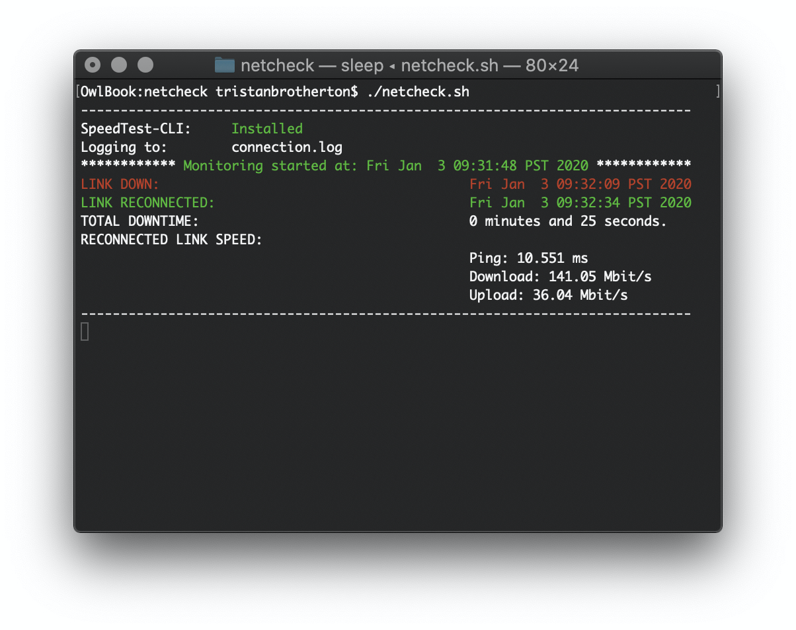
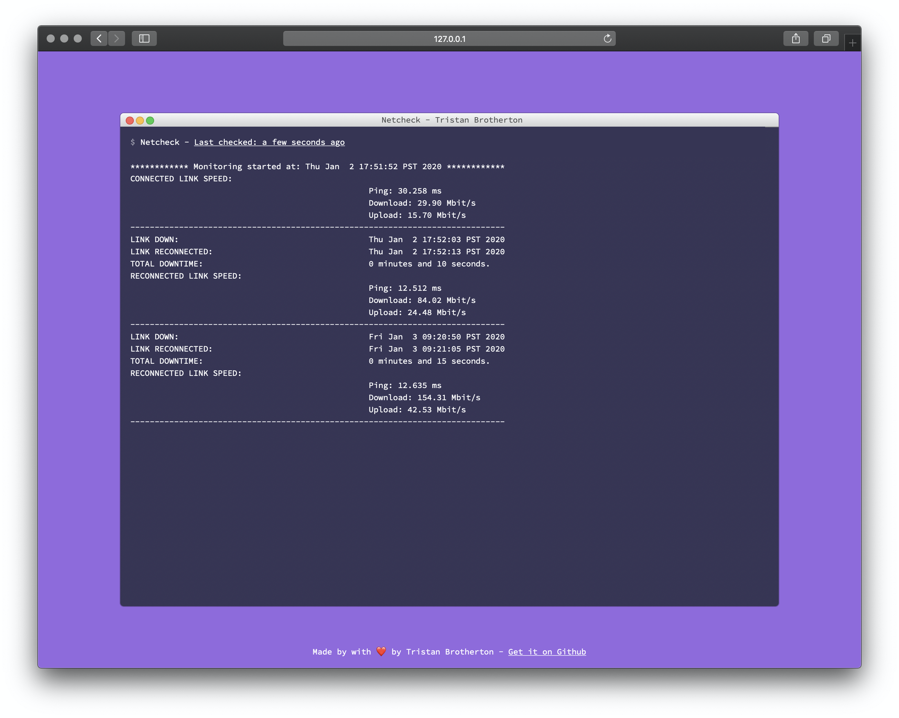
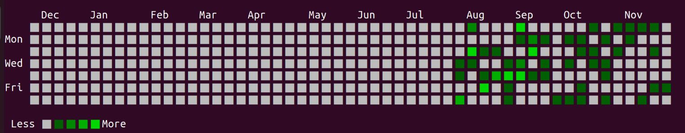

# Netcheck
A shellscript to check and log when your internet connection goes down. Netcheck checks for internet connectivity
and if its interupted, writes a log containing the time of disconnect, and length of time disconnected.
Once it reconnects it will log the reconnected internet speed and continue monitoring again.

Netcheck also include an optional web interface for viewing your connection logs remotely from a web browser.
You can use a service such as NGROK to allow you to see the web interface outside of your network.

 ## PRs Welcome! 
 If Necheck is mising something you'd like to have, feel free to submit a PR. 

## Installation

    git clone https://github.com/TristanBrotherton/netcheck.git
    cd netcheck
    chmod +x netcheck.sh
    ./netcheck.sh
    
### CLI Interface

### Web Interface

## Options
    netcheck.sh -h                                           Display this message
    netcheck.sh -f path/my_log_file.log          Specify log file and path to use
    netcheck.sh -s                                 Disable speedtest on reconnect
    netcheck.sh -c                Check connection ever (n) seconds. Default is 5
    netcheck.sh -u            URL/Host to check, default is http://www.google.com
    netcheck.sh -w                                  Enable the remote webinteface
    netcheck.sh -p                  Specify an optional port for the webinterface
    netcheck.sh -i                           Install netcheck as a system service
    netcheck.sh -d path/script            Specify script to execute on disconnect
    netcheck.sh -r path/script             Specify script to execute on reconnect
    netcheck.sh -t path/script        Specify script to execute after every check

## Run as a service
You can optionally run netcheck as a system service. For systems that use 
systemctl (Linux) you may use its service installation script:

    sudo ./netcheck.sh -i

## Scripts for disconnect/reconnect events
You can optionally define actions to be executed upon disconnect or reconnect.
To do so you may use the `-d` and `-r` options. 

Two sample `bash` scripts making use of the `espeak-ng` text-to-speech utility are provided
under the `sample-scripts` to showcase how these options can be used:

    ./netcheck.sh -d sample-scripts/disconnected.sh -r sample-scripts/reconnected.sh

## Script to display link down events
A github-like activity chart displaying link down events can be displayed with:

    ./internet_status_chart.sh

To load custom log file use the -f option:

    ./internet_status_chart.sh -f path/my_log_file.log

(The script is adapted from [https://github.com/aaossa/git-activity])
